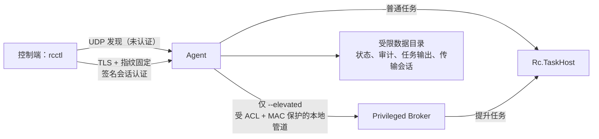

# WinAgentController

> 面向 **Windows 10/11 x64 局域网** 的单控制端远程控制原型。一个 `rcctl` 控制端与一台 Agent 建立经证书指纹固定的 TLS 连接；首次配对后，控制端可执行单次命令、管理可恢复任务、读写受限文件根目录并传输文件或目录。

> **项目状态：开发中。真实双机 Hyper-V VM 的 UI 自动化验收已完成，但项目仍未宣称完成所有版本、浏览器和部署场景的正式发布回归。** 进度与已知缺口以 [docs/CURRENT_PROGRESS.md](docs/CURRENT_PROGRESS.md) 为唯一权威来源。

## 目录

- [功能概览](#功能概览)
- [面向 Agent 的项目目标](#面向-agent-的项目目标)
- [Codex Skill](#codex-skill)
- [架构与安全边界](#架构与安全边界)
- [环境要求](#环境要求)
- [构建、发布与部署](#构建发布与部署)
- [一键更新](#一键更新)
- [首次连接与日常使用](#首次连接与日常使用)
- [命令参考](#命令参考)
- [运行配置](#运行配置)
- [声明、限制与安全注意事项](#声明限制与安全注意事项)

## 功能概览

| 类别 | 当前提供的能力 |
| --- | --- |
| 局域网发现 | Agent 通过 UDP 组播发布设备名、设备 ID、TLS 指纹与 TCP 端口；`rcctl discover` 可发现设备。 |
| 设备探测与配对 | `probe` 查看公开状态；`pair` 使用一次性代码和 J-PAKE 完成单控制端配对。控制端身份以 P-256 ECDSA 密钥保存。 |
| 安全控制通道 | TCP/TLS 连接固定校验 Agent 的 SHA-256 证书指纹；已配对控制端还需完成签名挑战会话认证。 |
| 单次命令 | `exec` 可通过 PowerShell 或 cmd 执行单条命令，并分别返回标准输出、标准错误和退出码。 |
| 长任务 | `job` 支持启动、查询、列表、输出读取/跟随、写入标准输入、关闭输入、取消、等待和 PTY 尺寸调整。任务与输出分段会持久化，支持在连接中断后继续查询。 |
| 文件操作 | `fs` 支持受控根目录内的列举、属性读取、分段读取和写入。 |
| 文件/目录传输 | `copy` 支持上传、下载、会话状态查询、分块哈希校验以及基于会话 ID 的续传。 |
| 显式提权 | `exec --elevated` 和 `job start --elevated` 可交给独立的本地 Privileged Broker。Broker 只监听本地命名管道，不开放网络端口。 |
| Windows 服务安装 | 安装脚本可部署 `RemoteControllerAgent`（LocalService）和 `RemoteControllerBroker`（LocalSystem）服务，创建受限数据目录并可添加 Private/Domain 入站防火墙规则。 |
| 一键更新 | `rcctl update apply` 可上传完整发布包、校验清单与分块哈希并触发受控更新；更新脚本停止服务、保留旧安装目录，并在安装脚本执行失败时回滚并重启旧服务。 |
| 桌面 UI 自动化 | 通过登录用户会话中的 `Rc.UiAgent` 支持显示器/窗口枚举、截图、窗口动作、鼠标、键盘、快捷键、文本、剪贴板和 Windows UI Automation 元素树/元素动作。 |
| 浏览器控制 | `rcctl ui browser` 支持 Edge/Chrome 启动、导航和受控 Chromium CDP DOM/可访问性树读取；浏览器操作要求目标登录会话和显式窗口句柄。 |

真实双机 Hyper-V VM 已完成多轮标准输入任务验收：测试程序先要求历史运行计数，再要求实时生成的随机挑战数；Controller 可读取两次提示、分别提交输入并确认任务成功及状态计数递增。

当前版本已经提供面向用户的 `rcctl ui ...` 命令。UI Agent 以指定用户的登录任务运行，并通过受 ACL 保护的本地管道向 Agent 注册；Agent 只在存在活动且近期注册的 UI 会话时转发已认证的 UI 请求。

## 面向 Agent 的项目目标

WinAgentController 的最终使用者不是人工桌面操作员，而是运行在控制端的 AI Agent 或其他自动化 Agent。项目的目标是为 Agent 提供一个可验证、可恢复、可审计的远端 Windows 控制面：

- Agent 可以发现被控机、核对设备指纹、完成一次性配对，并在后续请求中复用签名认证会话；
- Agent 可以用结构化 JSON 结果执行命令、管理长任务、读取增量日志、写入标准输入、取消任务和等待终态，而不需要解析远端桌面文本；
- Agent 可以在受限文件根目录内列举、读取、写入和传输文件/目录，并通过传输会话和分块哈希完成续传与完整性校验；
- Agent 可以明确选择普通权限或提权路径，所有高风险操作都应由调用方显式发起并留下可审计边界；
- 已提供面向浏览器和 Windows 交互界面的控制能力，使 Agent 能够读取 UI 状态、定位窗口/控件、执行鼠标键盘操作，并在浏览器场景优先使用页面语义或 DOM 信息，而不是依赖屏幕坐标猜测；真实双机 VM 验收记录见 [docs/CURRENT_PROGRESS.md](docs/CURRENT_PROGRESS.md)。

### 浏览器控制实现与参考实现

浏览器控制已经接入 UI Agent。实现参考了 [CursorTouch/Windows-MCP](https://github.com/CursorTouch/Windows-MCP) 的工具组织方式和 Windows 自动化实践，重点包括：

- Windows UI Automation 的窗口/控件状态读取、鼠标键盘交互和截图能力；
- 浏览器 DOM 模式（`use_dom=True`）对页面内容与浏览器外壳进行区分的思路；
- 对 Chrome、Edge 等浏览器的页面语义访问，以及在不同浏览器自动化接口不可用时的降级策略。

当前实现使用独立的 Chromium CDP 本机回环调试通道读取 Edge/Chrome 页面 DOM，并通过 UI Automation 处理窗口与浏览器外壳。当前已验证浏览器启动、导航、窗口句柄复用和页面 DOM 读取；Firefox 等浏览器的页面 DOM 能力不等同于 Chromium CDP 能力。

本项目没有直接复制 Windows-MCP 的代码。若后续直接复用其代码或 substantial portions，应在实现中保留 [Windows-MCP 的 MIT 许可和版权声明](https://github.com/CursorTouch/Windows-MCP/blob/main/LICENSE.md)，并在发布制品中补充第三方许可清单。浏览器控制同样必须受本项目的配对认证、权限隔离、会话范围和审计约束，不能因为浏览器自动化而绕过安全边界。

## Codex Skill

仓库内提供项目级 Agent Skill：[`operate-win-agent-controller`](.agents/skills/operate-win-agent-controller/SKILL.md)。它面向使用 Codex 或兼容 Agent Skills 的开发者，汇总了以下操作流程：

- 构建、测试和生成完整发布包；
- 在被控端执行一键初始化、保留或重新生成设备身份；
- 发现设备、核对 TLS 指纹并完成控制端配对；
- 使用 `rcctl` 执行命令、管理长任务、传输文件以及控制桌面和浏览器；
- 执行远程更新、诊断服务和核对当前测试缺口；
- 避免泄露配对码、误用 `--elevated` 或在常规刷新时意外清除已有配对。

在支持项目级 Skills 的客户端中打开本仓库后，可直接调用：

```text
$operate-win-agent-controller
```

若需要在其他项目或任务中使用，可从仓库根目录将其安装到当前 Windows 用户的 Codex Skills 目录：

```powershell
$source = Resolve-Path '.\.agents\skills\operate-win-agent-controller'
$destination = Join-Path $env:USERPROFILE '.codex\skills\operate-win-agent-controller'

if (Test-Path -LiteralPath $destination) {
    throw "目标 Skill 已存在，请先确认是否需要更新：$destination"
}

New-Item -ItemType Directory -Path (Split-Path $destination) -Force | Out-Null
Copy-Item -LiteralPath $source -Destination $destination -Recurse
```

安装后在下一次对话中使用 `$operate-win-agent-controller`。该 Skill 是 Agent 操作指南，不会替代被控端的 `Setup-RemoteControllerAgent.cmd`，普通部署用户无需安装它。具体行为仍以当前代码、脚本和 [`docs/CURRENT_PROGRESS.md`](docs/CURRENT_PROGRESS.md) 为准。

## 架构与安全边界



- **控制关系：** 每个 Agent 只保存一个已配对控制端。若要更换控制端，请在被控机本地运行 `Rc.Agent.exe unpair`，然后重新配对。
- **发现不等于信任：** UDP 发现包未认证，只能用来定位设备；执行 `probe`/`pair` 时必须通过可信渠道核对 TLS SHA-256 指纹。
- **传输保护：** 控制 API 使用 TLS；客户端不依赖系统证书链或主机名匹配，而是固定校验用户提供的 Agent 指纹。配对使用一次性代码和 J-PAKE，配对完成后由控制端私钥完成会话挑战签名。
- **权限分离：** 普通命令不应经 Broker；只有显式添加 `--elevated` 的执行请求才会走 Broker。不要把“远程命令”误当作低权限或沙盒能力。
- **数据保护：** Agent 默认数据根目录为 `C:\ProgramData\RemoteController`，并检查 ACL，拒绝可被不受信任主体写入的目录。控制端身份默认以当前用户 DPAPI 保护。

## 环境要求

### 开发、构建机

- Windows 10 或 Windows 11 x64。
- .NET SDK 8（项目目标为 `net8.0-windows`）。
- PowerShell 5.1+；安装和卸载服务必须在提升权限的 PowerShell 中执行。

### 被控机

- Windows 10/11 x64，与控制端处于可达网络。
- TCP 端口默认 `43001`；安装脚本可用 `-TcpPort` 修改。
- 使用安装脚本时，需要管理员权限，并且被控机允许创建 Windows 服务和防火墙规则。

## 构建、发布与部署

### 1. 开发环境验证

在仓库根目录执行：

```powershell
# 如仓库随附 .dotnet，可将 dotnet 替换为 .\.dotnet\dotnet.exe
dotnet restore Rc.RemoteController.sln -p:NuGetAudit=false
dotnet build Rc.RemoteController.sln --no-restore -warnaserror
dotnet test Rc.RemoteController.sln --no-build --no-restore -v minimal
```

### 2. 生成被控机安装包

使用仓库发布脚本生成规范的 Windows x64 完整发布包。该脚本与 Windows CI 使用同一发布入口，会把 Agent、Broker、TaskHost、UI Agent、验收程序、CLI 和部署脚本收集到同一目录：

```powershell
.\scripts\Publish-RemoteController.ps1 -OutputPath .\artifacts\publish -Configuration Release
```

将 `artifacts\publish` 复制到被控机（例如 `C:\Temp\WinAgentController`），并将其中的 `Rc.Cli.exe` 单独复制到控制端可执行位置。首次安装本身不要求被控机保留 CLI，但一键更新协议要求完整更新包包含 CLI，因此建议始终保存脚本生成的完整发布包。请按自己的发行、签名和恶意软件防护流程处理生成的可执行文件。

### 3. 安装为 Windows 服务

在**被控机的提升权限 PowerShell**中执行：

```powershell
Set-Location C:\Temp\WinAgentController
.\Install-RemoteController.ps1 -SourcePath $PWD -TcpPort 43001 -UiUser 'CONTOSO\alice'
```

脚本会：

1. 把发布文件复制到 `C:\Program Files\RemoteController`（可用 `-InstallPath` 改写）。
2. 创建或更新 `RemoteControllerBroker`（LocalSystem）与 `RemoteControllerAgent`（LocalService）服务，并让 Agent 依赖 Broker。
3. 创建并收紧 `C:\ProgramData\RemoteController`（可用 `-DataRoot` 改写）的 ACL。
4. 创建 `RemoteControllerUiAgent` 登录任务，在指定的交互用户会话中启动 `Rc.UiAgent.exe`，并为 Agent/UI Agent 配置相互受限的 SID 管道 ACL。
5. 默认添加名称为 `RemoteController Agent TCP` 的 Private/Domain 入站规则；若由外部防火墙管理，使用 `-NoFirewallRule`。

先预演再执行可使用 PowerShell 的 `-WhatIf`：

```powershell
.\Install-RemoteController.ps1 -SourcePath $PWD -WhatIf
```


### 3.1 被控端获取文件后的一键初始化

发布包包含 `Setup-RemoteControllerAgent.cmd`、`Setup-RemoteControllerAgent.ps1` 和 `RemoteController.Agent.config.json`。将整个发布包复制到被控端后，编辑配置文件并双击运行 `.cmd` 即可完成安装/刷新服务、生成 Agent TLS 身份并输出设备 ID、TLS SHA-256 指纹和一次性配对码：

```bat
Setup-RemoteControllerAgent.cmd
```

配置文件中的关键字段：

| 字段 | 说明 |
| --- | --- |
| `SourcePath` | 发布文件目录；默认 `.`，相对于配置文件所在目录。 |
| `InstallPath` / `DataRoot` | Agent 安装目录和状态目录。 |
| `TcpPort` | Agent TCP 端口，默认 `43001`。 |
| `UiUser` | UI Agent 登录用户；留空时使用当前管理员账户。 |
| `NoFirewallRule` | 是否跳过 Private/Domain 入站防火墙规则。 |
| `RegenerateIdentity` | 默认 `true`。每次运行先停止服务、清除旧配对并重新生成 TLS 证书/私钥，因此每次都会得到新指纹，控制端必须重新配对。设为 `false` 可仅刷新并重启服务、保留现有身份。 |
| `ArmPairing` | 默认 `true`，生成 10 分钟有效的一次性配对码。 |

脚本具备重复运行保护：每次运行都会先刷新安装文件并停止/启动 Broker、Agent 服务；启用 `RegenerateIdentity` 时会先本地解除旧控制端配对，再由 Agent 在服务重启时生成新的设备身份。私钥只保存在受 ACL 保护的数据目录中，不会打印到控制台。脚本会自动请求管理员权限。

### 4. UI Agent 与服务部署限制

服务安装会创建并启动 `RemoteControllerUiAgent` 登录任务，但 UI 自动化只在 `-UiUser` 指定的用户已登录且拥有活动桌面会话时可用。锁屏、注销、UAC 安全桌面、Winlogon 界面和没有活动会话时，UI 请求会返回不可用或前置条件失败；这不影响普通命令、任务和文件控制通道。

配对仍必须先由受管端本地管理员启用一次性配对流程，再由 Controller 输入代码。若一键初始化配置中的 `ArmPairing` 为 `true`，初始化脚本会直接输出配对码；否则可手动运行：

```powershell
& 'C:\Program Files\RemoteController\Rc.Agent.exe' arm-pairing
```

将 `arm-pairing` 返回的一次性代码通过可信渠道交给 Controller，再执行 `rcctl pair ... --code <code>`。交互式 `pair` 省略 `--code` 时仍会从标准输入读取代码。请勿将一次性代码写入聊天记录、UDP 广播或普通网络日志。

### 5. 卸载

在提升权限 PowerShell 中：

```powershell
.\Uninstall-RemoteController.ps1 -WhatIf   # 先预演
.\Uninstall-RemoteController.ps1           # 删除服务、防火墙规则、安装目录和数据目录
.\Uninstall-RemoteController.ps1 -KeepData # 保留 C:\ProgramData\RemoteController
```

卸载脚本拒绝递归删除 `Program Files` 或 `ProgramData` 以外的默认安全边界路径；自定义路径时仍应先执行 `-WhatIf` 并人工核对。

## 一键更新

控制端使用**完整发布包目录**更新已配对的被控机。包中必须包含 Agent、Broker、TaskHost、UI Agent、两个验收程序、CLI、`Install-RemoteController.ps1` 和 `Update-RemoteController.ps1`；上节的发布脚本会生成此目录。建议先在隔离环境验证待发布包，再执行生产升级。

```powershell
# --wait 会在 Agent 服务重启期间自动重连并等待最终状态。
& $rcctl update apply 192.168.1.50:43001 --fingerprint <SHA256> `
  --package .\artifacts\publish --wait --timeout-seconds 600 --text

# 如控制端在升级过程中退出，可用上一次输出的 updateId 继续查询。
& $rcctl update status 192.168.1.50:43001 --fingerprint <SHA256> `
  --update <updateId> --text
```

控制端会从包内 `Rc.Agent.exe` 读取版本（无法读取时必须显式传入 `--version`），构建 SHA-256 清单后以默认 256 KiB 分块上传；可用 `--chunk-size 1-262144` 调整。被控端只接受已配对控制端的签名请求，拒绝路径越界、篡改块、缺失必需文件、超过 1 GiB 的包及版本降级。更新会话和任务 ID 存放在受保护的数据根中，便于重连后查询。

更新脚本会停止 UI Agent、Agent 和 Broker，将旧安装目录移至同一卷的临时备份，再运行安装脚本。安装脚本抛出错误时会删除不完整的新目录、恢复旧目录并尝试启动旧服务；当前成功判定依据更新任务退出码，不包含更新后的服务健康探针或业务验收。`C:\ProgramData\RemoteController` 中的证书、配对、任务和审计数据不会被删除。真实双节点更新、断线续传和失败回滚的发布环境验收仍在进行中，状态以 [docs/CURRENT_PROGRESS.md](docs/CURRENT_PROGRESS.md) 为准。

## 首次连接与日常使用

下文以控制端 CLI 为例。可为路径设置别名以简化输入：

```powershell
$rcctl = 'C:\Tools\WinAgentController\Rc.Cli.exe'
```

### 发现并核对设备

```powershell
& $rcctl discover --timeout-ms 4000 --text
& $rcctl probe 192.168.1.50:43001 --fingerprint <64位SHA256指纹> --text
```

从可信的被控机控制台、受控资产登记或其他带外渠道核对指纹。不要仅依据 UDP 发现结果或他人发送的地址/指纹执行配对。

### 配对

```powershell
& $rcctl pair 192.168.1.50:43001 `
  --fingerprint <64位SHA256指纹> --code <一次性配对码> `
  --name MyController --text
```

也可以省略 `--code`，让 CLI 从标准输入读取代码。代码有效期很短，输入成功后才会建立并保存控制端身份。一个 Agent 已有配对后会拒绝新的配对请求。

### 运行命令和任务

```powershell
# 单次 PowerShell 命令
& $rcctl exec 192.168.1.50:43001 --fingerprint <SHA256> `
  --command 'Get-ComputerInfo | Select-Object WindowsProductName' --text

# 通过 cmd 执行，并指定工作目录
& $rcctl exec 192.168.1.50:43001 --fingerprint <SHA256> `
  --shell cmd --workdir 'C:\Temp' --command 'dir' --text

# 启动可查询的长任务；输出中的 job ID 用于后续操作
& $rcctl job start 192.168.1.50:43001 --fingerprint <SHA256> `
  --command 'ping 127.0.0.1 -n 20' --text

& $rcctl job logs 192.168.1.50:43001 --fingerprint <SHA256> --job <jobId> --follow --text
& $rcctl job wait 192.168.1.50:43001 --fingerprint <SHA256> --job <jobId> --timeout-ms 60000 --text
```

只有明确了解被控机影响时才使用 `--elevated`。例如：

```powershell
& $rcctl exec 192.168.1.50:43001 --fingerprint <SHA256> `
  --elevated --command 'whoami /all' --text
```

### 文件与目录传输

Agent 端文件服务限制在 `RC_AGENT_FILE_ROOT`（默认由运行账户的用户目录决定）以内；传入路径应使用该根目录下的相对路径或受实现接受的安全路径。先用 `fs list`/`stat` 确认目标。

```powershell
# 列出和读取
& $rcctl fs list 192.168.1.50:43001 '.' --fingerprint <SHA256> --recursive
& $rcctl fs read 192.168.1.50:43001 'logs\agent.log' --fingerprint <SHA256> --offset 0 --max-bytes 262144 --text

# 写入文本或从本地文件写入（默认不覆盖；使用 --overwrite 明确覆盖）
& $rcctl fs write 192.168.1.50:43001 'notes\hello.txt' --fingerprint <SHA256> --data 'hello'
& $rcctl fs write 192.168.1.50:43001 'notes\binary.bin' --fingerprint <SHA256> --source .\binary.bin --overwrite

# 上传本地文件/目录、下载远端文件/目录
& $rcctl copy upload 192.168.1.50:43001 .\build-output --fingerprint <SHA256> --to 'incoming\build-output'
& $rcctl copy download 192.168.1.50:43001 'incoming\build-output' --fingerprint <SHA256> --to .\restored
```

传输开始时 CLI 会在标准错误写出 `transferSession=<id>`。中断后可用会话 ID 查询或续传：

```powershell
& $rcctl copy status 192.168.1.50:43001 <transferSessionId> --fingerprint <SHA256>
& $rcctl copy upload 192.168.1.50:43001 .\build-output --fingerprint <SHA256> `
  --to 'incoming\build-output' --session <transferSessionId>
```

### 桌面 UI 与浏览器控制

UI 命令使用与其他控制请求相同的 TLS 指纹固定和已配对会话。先确认登录用户会话可用，再使用显式的 `display <index>` 或 `window <handle>` 目标：

```powershell
& $rcctl ui status 192.168.1.50:43001 --fingerprint <SHA256> --text
& $rcctl ui displays 192.168.1.50:43001 --fingerprint <SHA256> --text
& $rcctl ui windows 192.168.1.50:43001 --fingerprint <SHA256> --text

# 获取窗口 UI Automation 元素树，并对 runtime ID 执行元素动作。
& $rcctl ui elements 192.168.1.50:43001 --fingerprint <SHA256> `
  window <handle> --depth 8 --limit 1000
& $rcctl ui element 192.168.1.50:43001 --fingerprint <SHA256> `
  window <handle> <runtime-id> setvalue 'hello'

# 截图、窗口动作、输入和剪贴板。
& $rcctl ui screenshot 192.168.1.50:43001 --fingerprint <SHA256> window <handle>
& $rcctl ui window 192.168.1.50:43001 --fingerprint <SHA256> window <handle> activate
& $rcctl ui mouse 192.168.1.50:43001 --fingerprint <SHA256> move window <handle> 200 120
& $rcctl ui shortcut 192.168.1.50:43001 --fingerprint <SHA256> window <handle> Control L
& $rcctl ui clipboard 192.168.1.50:43001 --fingerprint <SHA256> write 'https://example.com'
& $rcctl ui clipboard 192.168.1.50:43001 --fingerprint <SHA256> read --text

# 浏览器：启动后使用返回的窗口句柄继续导航和读取 DOM。
& $rcctl ui browser 192.168.1.50:43001 --fingerprint <SHA256> `
  launch edge 'https://example.com'
& $rcctl ui browser 192.168.1.50:43001 --fingerprint <SHA256> `
  navigate <handle> 'https://example.com/docs'
& $rcctl ui browser 192.168.1.50:43001 --fingerprint <SHA256> `
  dom <handle> --depth 10 --limit 2000
```

`ui browser dom` 只返回受控浏览器页面的 DOM/可访问性节点，不返回地址栏、标签页和浏览器框架。浏览器正文读取依赖 Chromium CDP；截图可作为页面视觉内容的兜底，但不应把截图解析当作稳定的结构化 DOM 接口。不要在目标桌面打开会抢占前台焦点的 PowerShell、测试窗口或其他可见程序。

## 命令参考

所有地址均使用 `IP:port`（例如 `192.168.1.50:43001`），指纹为 64 位十六进制 SHA-256 值，允许以冒号分隔。除显式 `--text` 的人类可读输出外，CLI 成功响应会输出 JSON 结果；失败会写入标准错误并返回非零退出码。

| 命令 | 用途与主要选项 |
| --- | --- |
| `rcctl discover [--timeout-ms 1-60000] [--text]` | 监听 UDP 发现公告。 |
| `rcctl probe <IP:port> --fingerprint <SHA256> [--text]` | 读取 Agent 的公开设备与配对状态，同时验证 TLS 指纹。 |
| `rcctl pair <IP:port> --fingerprint <SHA256> [--name <名称>] [--code <一次性配对码>] [--text]` | 发起首次配对；省略 `--code` 时从标准输入读取一次性代码。 |
| `rcctl exec <IP:port> --fingerprint <SHA256> --command <命令> [--shell powershell\|cmd] [--workdir <路径>] [--elevated] [--text]` | 执行单次命令。 |
| `rcctl job start <IP:port> ... --command <命令> [--shell ...] [--workdir ...] [--elevated] [--pty] [--cols 1-1000] [--rows 1-1000] [--text]` | 启动持久化任务。 |
| `rcctl job status <IP:port> --fingerprint <SHA256> --job <jobId> [--text]` | 查询单个任务状态。 |
| `rcctl job list <IP:port> --fingerprint <SHA256> [--state <JobState>] [--text]` | 列出任务，可按状态过滤。 |
| `rcctl job logs <IP:port> --fingerprint <SHA256> --job <jobId> [--stream stdout\|stderr] [--after-offset <非负数>] [--max-bytes 1-262144] [--follow] [--text]` | 获取或跟随任务输出；offset 用于续读。 |
| `rcctl job input <IP:port> --fingerprint <SHA256> --job <jobId> --data <文本> [--text]` | 向任务写入 UTF-8 标准输入。 |
| `rcctl job close-input <IP:port> --fingerprint <SHA256> --job <jobId> [--text]` | 关闭任务标准输入。 |
| `rcctl job cancel <IP:port> --fingerprint <SHA256> --job <jobId> [--text]` | 请求取消任务。 |
| `rcctl job wait <IP:port> --fingerprint <SHA256> --job <jobId> [--timeout-ms 0-86400000] [--text]` | 等待任务达到终态。 |
| `rcctl job resize <IP:port> --fingerprint <SHA256> --job <jobId> [--cols 1-1000] [--rows 1-1000] [--text]` | 调整 PTY 任务的终端尺寸。 |
| `rcctl fs list\|stat\|read\|write <IP:port> <路径> --fingerprint <SHA256> ...` | 文件根目录内的列举、属性、读取和写入；`read` 支持 `--offset`/`--max-bytes`，`write` 使用 `--data` 或 `--source`，可加 `--overwrite`。 |
| `rcctl copy upload\|download <IP:port> <路径> --fingerprint <SHA256> --to <路径> [--chunk-size <字节>] [--session <id>]` | 上传或下载文件/目录，`--session` 用于继续既有会话。 |
| `rcctl copy status <IP:port> <会话ID> --fingerprint <SHA256>` | 查询传输会话。也可使用 `--session <会话ID>`。 |
| `rcctl update apply <IP:port> --fingerprint <SHA256> --package <目录> [--version <版本>] [--chunk-size 1-262144] [--wait] [--timeout-seconds 1-3600] [--text]` | 上传完整发布包并启动带回滚的更新。 |
| `rcctl update status <IP:port> --fingerprint <SHA256> --update <GUID> [--text]` | 查询已提交更新的接收、应用或最终状态。 |
| `rcctl ui status\|snapshot\|displays\|windows <IP:port> --fingerprint <SHA256> [--text]` | 查询活动 UI 会话、显示器、窗口和快照。 |
| `rcctl ui screenshot <IP:port> --fingerprint <SHA256> <display\|window> <目标>` | 获取指定显示器或窗口的 PNG 截图。 |
| `rcctl ui window <IP:port> --fingerprint <SHA256> window <句柄> <activate\|minimize\|maximize\|restore\|close>` | 控制窗口状态。 |
| `rcctl ui move <IP:port> --fingerprint <SHA256> window <句柄> <x> <y> <width> <height>` | 移动并调整窗口大小。 |
| `rcctl ui mouse <IP:port> --fingerprint <SHA256> <move\|button\|wheel> ...` | 在显式显示器/窗口目标上执行鼠标操作。 |
| `rcctl ui key\|shortcut\|type <IP:port> --fingerprint <SHA256> ...` | 投递按键、快捷键或 Unicode 文本；可靠控件赋值优先使用 `ui element ... setvalue`。 |
| `rcctl ui clipboard read\|write <IP:port> --fingerprint <SHA256> ...` | 读写活动 UI 会话的文本剪贴板。 |
| `rcctl ui elements\|element <IP:port> --fingerprint <SHA256> window <句柄> ...` | 获取 UI Automation 元素树，或按 runtime ID 执行 focus、invoke、setvalue、select、expand、collapse。 |
| `rcctl ui browser <IP:port> --fingerprint <SHA256> launch\|navigate\|dom ...` | 启动/导航 Edge 或 Chrome，并读取受控浏览器的 DOM。 |
| `Rc.Agent.exe unpair` | **在被控机本地**删除现有控制端配对并使待配对邀请失效。 |

CLI 无参数或未知命令会输出总览用法；成功的非 `--text` 命令通常输出单个 JSON envelope。失败会写入标准错误并返回非零退出码，但当前部分命令仍输出纯文本错误，并未统一提供稳定错误码。具体参数规则和输出格式以 `src\Rc.Cli\Commands` 的实现为准。

## 运行配置

| 环境变量 | 默认值 | 作用 |
| --- | --- | --- |
| `RC_AGENT_DATA_ROOT` | `C:\ProgramData\RemoteController` | Agent 状态、审计、任务输出和传输会话所在目录。 |
| `RC_AGENT_TCP_PORT` | `43001` | Agent TLS 控制端口。 |
| `RC_AGENT_FILE_ROOT` | Agent 运行账户的用户目录 | 允许 `fs` 与 `copy` 操作的根目录。 |
| `RC_NORMAL_TASK_LIMIT` | `8` | 普通任务并发上限。 |
| `RC_ELEVATED_TASK_LIMIT` | `2` | 提权任务并发上限。 |
| `RC_LOG_QUOTA_BYTES` | `200 MiB` | 日志配额。 |
| `RC_TASK_OUTPUT_LIMIT_BYTES` | `200 MiB` | 任务输出配额。 |
| `RC_AUDIT_QUOTA_BYTES` | `16 MiB` | 审计记录配额。 |
| `RC_TRANSFER_QUOTA_BYTES` | `200 MiB` | 传输数据配额。 |
| `RC_TRANSFER_MAX_CHUNK_BYTES` | `1 MiB` | 传输分块最大值。 |
| `RC_UPDATE_MAX_PACKAGE_BYTES` | `1 GiB` | 一次一键更新允许接收的最大包大小。 |
| `RC_UPDATE_MAX_CHUNK_BYTES` | `256 KiB` | 一键更新分块的最大值；控制端 `--chunk-size` 不得超过它。 |
| `RC_FILE_MAX_WRITE_BYTES` | `16 MiB` | `fs write` 单次原子写入最大值。 |
| `RC_CONTROLLER_DATA_ROOT` | `%LOCALAPPDATA%\RemoteController` | 控制端 DPAPI 保护的身份文件目录。 |
| `RC_UI_AGENT_CLIENT_SID` | 安装脚本根据 `-UiUser` 设置 | Agent 注册管道允许连接的 UI 用户 SID。 |
| `RC_UI_AGENT_CONTROL_CLIENT_SID` | 安装脚本设置为 Agent 服务 SID | UI Agent 控制管道允许连接的 Agent SID。 |

安装脚本会为两个服务写入其所需环境变量，包括 Broker 密钥路径、TaskHost 路径、受信任 SID 与 TCP 端口。手工运行 Agent 时，如果要与服务实例共享状态或使用自定义根目录，应显式设置对应变量并理解 DPAPI 绑定到运行账户带来的影响。

安装脚本当前不会设置 `RC_AGENT_FILE_ROOT`；以默认 LocalService 账户运行时，文件根目录取该服务账户的用户目录。生产部署建议把它显式设置为专用数据目录，并在修改 `RemoteControllerAgent` 服务的 `Environment` 多字符串配置后重启服务。不要用普通进程级 `set`/`$env:` 临时变量代替服务环境配置。

## 声明、限制与安全注意事项

1. **仅限授权环境。** 本项目可远程执行命令、读写文件和启动提升权限任务。仅在您拥有明确授权的设备、账户和网络中使用；部署前请完成资产审批、网络隔离与审计安排。
2. **这是远程管理工具，不是沙盒。** 配对后的控制端在 Agent 允许范围内可请求任意命令；`--elevated` 的影响尤其大。请将控制端私钥、被控机本地管理员权限和 Broker 配置视为高敏感资产。
3. **必须带外核验指纹。** 局域网发现未认证，存在伪造公告风险。不要跳过 TLS 指纹的独立核验，也不要把一次性配对码发送到不可信通信渠道。
4. **UI 自动化需要活动登录会话。** UI Agent 以指定用户的交互式登录任务运行；注销、锁屏、没有显示器/窗口的会话、UAC 安全桌面和 Winlogon 界面不属于支持范围。远程 UI 操作不会绕过 Windows UIPI 或安全桌面。
5. **浏览器 DOM 有边界。** 当前页面结构读取主要依赖受控 Edge/Chrome 的 Chromium CDP；浏览器启动、窗口枚举、导航、截图和页面标题/DOM 读取已验收，但不同版本浏览器、扩展页面、跨域内容和复杂页面仍需按目标环境验证。
6. **键盘输入受输入法影响。** `key`/`shortcut` 保证投递虚拟按键，不保证所有 IME 或业务控件最终产生相同文本；需要确定性写值时优先使用 UI Automation `setvalue` 或剪贴板粘贴。
7. **任务恢复有边界。** 状态、任务元数据、输出和传输会话会持久化以支持查询/续读；但系统重启、进程崩溃、外部命令自身行为和权限变化都可能使任务进入终态或不可继续。不要依赖它自动重放任意命令。
8. **文件根目录必须最小化。** 通过 `RC_AGENT_FILE_ROOT` 将暴露范围限制为专用目录，不要直接把系统盘根目录、用户配置目录或敏感凭据目录设为根目录。
9. **文档与实现版本需同步。** UI 和浏览器能力已完成主要实现与验收，但仍应在目标 Windows 版本、网络策略、终端防护和服务账户策略下执行完整发布回归。
10. **更新仍需发布环境门禁。** 更新请求会经过配对认证和完整性校验，并带有安装目录回滚；但生产前仍应在目标服务账户、终端防护和网络策略下完成真实双节点升级、断线恢复和故障回滚演练。
